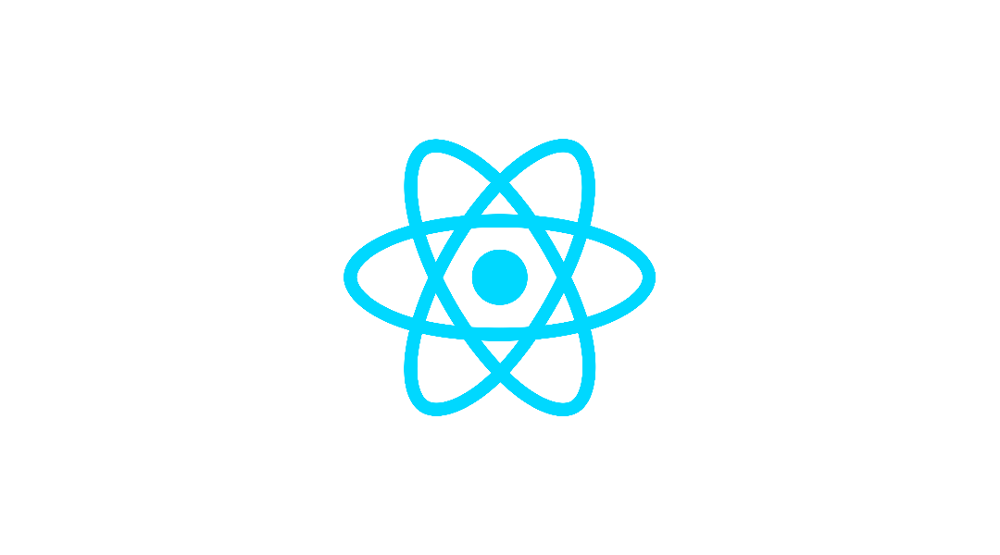

# Notionary

## 프로젝트 소개
Notionary 는 개인 워크스페이스를 사용할수 있고 사람들의 질문과 본인의 의견을 낼수 있는 소통 공간으로 개발하게 됬습니다. 여기에서는 우리가 워크스페이스를 정리하면서 카태고리별로 굼금한 글과 질문을 작성할수 있습니다. 글을 작성할때 본인의 워크스페이스를 공유하면서 굼금한 것을 물어볼수도 있습니다.

# 목차
- [프로젝트 소개](#프로젝트-소개)
- [팀원 소개](#팀원-소개)
- [화면 구성](#화면-구성)
- [주요 기능](#주요-기능)
- [개발 기간](#개발-기간)
- [기술 스택](#기술-스택)
- [협업 도구](#협업-도구-communication)
- [테이블 구성](#테이블-구성)

---

## 팀원 소개 

 
<a href="https://github.com/Mr-Binod">팀원 : 비노드 </a> 
역활활 : 워크스페이시 페이지 구현

 

 
<a href="https://github.com/susuholee">팀원 : 이수호 </a> 
역활 : 글 추가 페이지, 메인 페이지, 수정 페이지

 

 
<a href="https://github.com/Sialsry">팀원 : 김민교 </a> 
역활 : 회원가입 페이지, 로그인 페이지, 마이 페이지, 상세 페이지

## 화면 구성 :
<label>웤크스페이스 폴더 생성</label>

<label>페이지 생성</label>

<label>워크스페이스 기능</label>

<label>삭제 기능</label>

## 주요 기능: 

### 담당 : 워크스페이스 페이지
- 사용자가 글 작성 사진, 텍스트, 제목, 글머리 기호 목록, 번호 매기기 목록, 할일 목록 등을 선택해서 원하는 글을 작성 가능
- 키보드를 늘릴할떄마다 입력한 값이 데이트베이스에 저장.
- 드래그 (drag) 기능을 사용 가능
- 메인 페이지에서 저장된 워크스페이스를 공유. 공유 된 워크스페이스는 읽이만 가능
- 페이지 삭제 기능
- 워크스페이스 폴더 삭제하면 페이지랑 내용까지 자동 삭제

## 개발 기간
- 2025-05-16 ~ 2025-06-1 (16일)

## API 문서 
- GET /workspacedataOne    : 전체 워크스페이스 데이터 조회
- GET /selectspace/:workspacename/:foldername/:filename    : 페이지 내용 조회

- POST /newFolder   : 워크스페이스 폴더 추가
- POST /newPage     : 페이지 추가
- POST /selectspace/:workspacename/:foldername/:filename    : 페이지 내용 추가

- DELETE /delworkspace     : 워크스페이스 폴더 삭제
- DELETE /delworkspacepage     : 페이지 삭제

## 기술 스택 
### FRONTEND

### BACKEND

### 협업 도구 COMMUNICATION 

## 테이블 구성

### 프론트 폴더 구조
---
📦Notionary

┣ 📂 프론트

┣ 📂src

    ┣ 📂 API

    ┣ 📂 Components

    ┣ 📂 css

    ┣ 📂 Hooks

    ┣ 📂 images

    ┣ 📂 Reducer

    ┣ 📂 Store
  
 ┣ 📜 App.js

 ┣ 📜 index.js

 ┣ 📜 package-lock.json

 ┣ 📜 package.json

### 백엔드 폴더 구조
---
┣ 📂 백엔드

┣ 📂controllers

┣ 📂middlewares

┣ 📂models

┣ 📂public

┣ 📂routers

┣ 📂script
  
 ┣ 📜 App.js

 ┣ 📜 index.js

 ┣ 📜 package-lock.json

 ┣ 📜 package.json